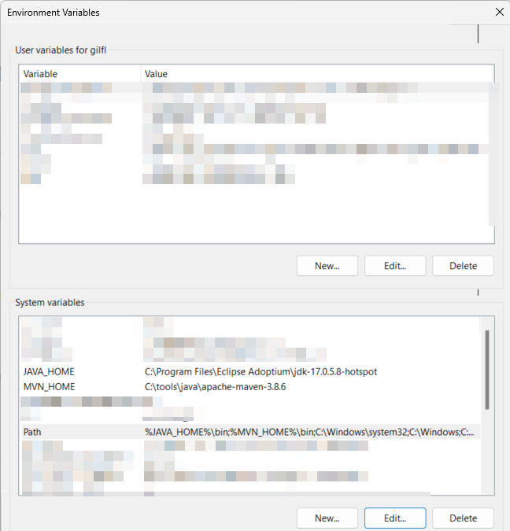

## Ejecutar la aplicación con Maven

En una terminal con JAVA_HOME y el path correctamente configurados, verificar la sección [Configuracion de Java](#configuracion-de-java)

```bash
mvn clean package
```

### Si las variables de entorno no están configuradas ejecutar


**Windows**
```shell
SET MVN_HOME="C:\toos\Java\apache\apache-maven-3.8.3"
SET JAVA_HOME="C:\Program Files\Eclipse Adoptium\jdk-17.0.5.8-hotspot"
SET PATH=%PATH%;%JAVA_HOME%\bin;%MVN_HOME%\bin
mvn clean package
```

Se incluye documentación de Windows para utilizar Java 17 en el readme


## Inicializar la aplicación con Docker

Ejecutar la aplicación y la base de datos utilizar el comando:

```bash
docker-compose up
```

Levantar únicamente el contenedor de MySQL

```bash
docker-compose up db
```


## Configuraciones para el proyecto

Este proyecto utiliza configuraciones de GitHub para el CI utilizando Actions. Esta configuración se encuentra en:

- [.github/linters/sun_checks.xml](.github/linters/sun_checks.xml): Configuración de CheckStyle para validación del proyecto
- [.github/workflows/maven.yml](.github/workflows/maven.yml): En este archivo se encuentra el proceso para ejecutar el lint del proyecto y sus pruebas, para validar la integración continua

## Software para el taller

### Requerido 

- [Java Jdk 17](https://adoptium.net/temurin/releases/)
- [Maven](https://maven.apache.org/download.cgi)

### Software opcional

- [Docker](https://docs.docker.com/get-docker/)
- [Docker compose](https://docs.docker.com/compose/install/)

### IDE's

- [IntelliJ Idea Community](https://www.jetbrains.com/idea/download/) **Recomendado** para el taller
- [Eclipse Java and Web Developers](https://www.eclipse.org/downloads/packages/)
- [Visual Studio Code](https://code.visualstudio.com/)

### Bases de datos

- [MySql](https://www.mysql.com/downloads/)
- [MariaDb](https://mariadb.org/download/)
- [PostgreSQL](https://www.postgresql.org/download/)

### Ligas de utilidad

- [Spring Initialzr](https://start.spring.io/)

## Configuracion de Java

- Instalar Java 17 en la ruta elegida
- Agregar la variable de entorno en Windows `JAVA_HOME` apuntando a la ruta de instalación
- Modificar la variable de entorno `PATH` para incluir `%JAVA_HOME%\bin` en Windows `$JAVA_HOME\bin` en Linux
- Descompactar el archivo con de maven, ejemplo: `apache-maven-3.8.6-bin.zip` en la carpeta `C:\tools\java\` en Windows
- Agregar la variable de entorno `MVN_HOME` apuntando a la ruta de instalación de maven
- Modificar la variable de entorno `PATH` para incluir `%MVN_HOME%\bin` en Windows `$MVN_HOME\bin` en Linux

### Windows  
Agregar variables en Windows Command prompt
```shell
SET MVN_HOME="C:\toos\Java\apache\apache-maven-3.8.3"
SET JAVA_HOME="C:\Program Files\Eclipse Adoptium\jdk-17.0.5.8-hotspot"
SET PATH=%PATH%;%JAVA_HOME%\bin;%MVN_HOME%\bin
```

### Linux
Agregar variables en Windows Command prompt
```shell
export MVN_HOME=/home/dev/toos/java/apache-maven-3.8.3
export JAVA_HOME=/usr/lib/jvm/java-17-openjdk-amd64
export PATH=$PATH;$JAVA_HOME\bin;$MVN_HOME\bin
```

Las variables se mostrarán de la siguiente manera en Windows




## Usar MySql

Cambiar el archivo docker-compose.yml de la siguiente manera:

```yaml
version: '3.7'

services:
  db:
    container_name: mysql
    image: mysql:latest
    ports:
      - '3306:3306'
    environment:
      MYSQL_ROOT_PASSWORD: admin
      MYSQL_DATABASE: persona
      MYSQL_USER: persona-user
      MYSQL_PASSWORD: persona-password

  app:
    container_name: app
    image: persona:latest
    build:
      context: .
      dockerfile: Dockerfile.dev
    ports:
      - '8080:8080'
    expose:
      - 8080
    environment:
      SPRING_PROFILES_ACTIVE: docker
    depends_on:
      - db
```

Incluir la conexión a MySql en el archivo application-docker.properties de la siguiente manera:

```properties
spring.datasource.url=jdbc:mysql://db:3306/persona
spring.datasource.username=persona-user
spring.datasource.password=persona-password
spring.jpa.database=MYSQL
```

En el archivo Dockerfile.dev cambiar para validar los puertos de MySql en la sección del ENTRYPOINT del segundo bloque de la configuración

```yaml
ENTRYPOINT ["./wait-for-it.sh", "db:3306", "--strict", "--timeout=300", "--", "java", "-jar", "app.jar"]
```

